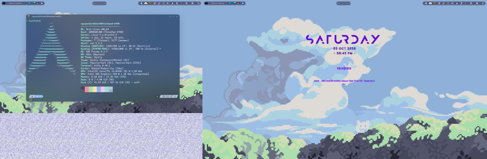

# ARCH LINUX + KDE PLASMA 6 COMPREHENSIVE CUSTOMIZATION SUITE

[English](README.md) | [Tiếng Việt](README_VI.md)

> **Tailored for ThinkPad E490 / Arch Linux x86_64**  
> A complete dotfiles and configuration repository covering desktop aesthetics, widgets, typography, panel layout, keybindings, terminal environment, and aggressive battery life and performance optimizations.



---

## TABLE OF CONTENTS
1. [One-Command Desktop Restoration](#1-one-command-desktop-restoration)
2. [Repository Structure](#2-repository-structure)
3. [Comprehensive Customization Breakdown](#3-comprehensive-customization-breakdown)
   - [Appearance & Themes](#a-appearance--themes)
   - [Panel Layout & Widgets](#b-panel-layout--widgets)
   - [Typography & Font Rendering](#c-typography--font-rendering)
   - [KWin Window Management & Tiling](#d-kwin-window-management--tiling)
   - [Keybindings & Shortcuts](#e-keybindings--shortcuts)
   - [Kitty Terminal & Zsh Shell](#f-kitty-terminal--zsh-shell)
   - [Vietnamese Input Method](#g-vietnamese-input-method)
   - [ThinkPad Battery & Performance Optimization](#h-thinkpad-battery--performance-optimization)
4. [Backup & Synchronization Workflow](#4-backup--synchronization-workflow)
5. [Clean Installation Guide](#5-clean-installation-guide)
6. [Troubleshooting](#6-troubleshooting)

---

## 1. ONE-COMMAND DESKTOP RESTORATION

When a panel is accidentally deleted, an interface layout breaks, fonts are altered, or you want to return the system to its initial perfected state:

### Step 1: Open a terminal and navigate to this repository:
```bash
cd ~/Documents/GitHub/linux-customizations
```

### Step 2: Execute the restoration script:
```bash
./restore.sh
```
*(The script automatically creates a backup of current configurations at `~/.config.backup.<timestamp>` prior to making any modifications).*

### Advanced flags for `restore.sh`:
- `./restore.sh --all` : Complete automated restoration (UI, fonts, wallpapers, and `/etc` system-level optimizations).
- `./restore.sh --ui` : Restores only user-space settings (panel layout, widgets, fonts, theme, and terminal configs) without altering `/etc` or prompting for root privileges.
- `./restore.sh --fonts` : Reinstalls all bundled fonts and rebuilds the font cache.
- `./restore.sh --system` : Applies only `/etc` system-level battery and hardware tuning configurations.

> [!TIP]
> After running the restoration script, log out and log back in (or restart the machine) so that all fonts, window shaders, and blur effects take effect cleanly across all running applications.

---

## 2. REPOSITORY STRUCTURE

```
linux-customizations/
├── README.md                      # English documentation (this file)
├── README_VI.md                   # Detailed Vietnamese guide
├── restore.sh                     # One-click restoration script
├── backup.sh                      # One-click script to synchronize system changes into the repository
├── config/                        # User configuration directory (~/.config)
│   ├── kdeglobals                 # Catppuccin palette, SF Pro typography, Mauve accent color
│   ├── kwinrc                     # KWin effects (Wobbly windows, Blur, Night Color, Tiling layout)
│   ├── kwinrulesrc                # Application window behavior rules
│   ├── kwinoutputconfig.json      # Multi-monitor display settings (eDP-1 ThinkPad + DP-1 external 100Hz)
│   ├── plasmarc                   # Plasma theme base settings (Ant-Dark)
│   ├── plasmashellrc              # Plasma shell configuration
│   ├── plasma-org.kde.plasma.desktop-appletsrc # Top panel layout, widget hierarchy, and custom launcher icon
│   ├── darklyrc                   # Darkly style window decoration opacity, blur, and styling
│   ├── kdedefaults/               # Default desktop look-and-feel package definitions
│   ├── kcminputrc                 # Bibata-Modern-Ice cursor and touchpad behaviors
│   ├── kscreenlockerrc            # Lock screen parameters
│   ├── ksplashrc                  # Splash screen configuration (Catppuccin_Final)
│   ├── kglobalshortcutsrc         # System keybindings and window manager shortcuts
│   ├── fontconfig/                # Font antialiasing, subpixel RGB, hinting, and LCD filter settings
│   ├── kitty/                     # Kitty terminal emulator configuration with Catppuccin Mocha theme
│   ├── fastfetch/                 # Fastfetch hardware summary configuration
│   ├── fcitx5/                    # Fcitx5 input method configuration (if installed)
│   ├── gtk-3.0/ & gtk-4.0/        # GTK application theme synchronization with KDE
│   ├── easyeffects/               # Audio equalizer and sound processing profiles
│   └── hypr/                      # Quickshell color palette for terminal greeting banners
├── home/                          # Configuration files deployed to $HOME
│   ├── .zshrc                     # Zsh configuration with dynamic Fastfetch banner, plugins, and smart cd
│   ├── .p10k.zsh                  # Powerlevel10k prompt configuration
│   ├── .gtkrc-2.0                 # Legacy GTK2 theme configuration
│   ├── .gitconfig                 # Personal Git configuration
│   ├── .face                      # User lock screen avatar
│   └── .face.icon                 # User account icon
├── local_bin/                     # User executable utilities (~/.local/bin)
│   └── sync-sweet-darkly          # Utility synchronizing Darkly blur opacity to Sweet Plasma theme
├── local_share/                   # User desktop resources (~/.local/share)
│   ├── fonts/                     # Bundled fonts: SF Pro, JetBrains Mono, Annotation Mono, Iosevka
│   ├── icons/                     # Cursor themes (Bibata) and icon packs (Papirus-Dark, Breeze-Noir, candy)
│   ├── color-schemes/             # Catppuccin Mocha color schemes
│   ├── aurorae/                   # Otto window decoration theme
│   ├── plasma/                    # Desktop themes (Sweet, Ant-Dark), Look-and-Feel (Final_S), Plasmoids (Panel Colorizer)
│   ├── kwin/                      # KWin corner rounding shaders (shapecorners) & KWin script (maxpadd)
│   └── easyeffects/               # Audio equalizer preset (live_eq.json)
├── system/                        # System-level optimizations deployed to /etc
│   ├── setup-battery-saver.sh     # Autonomous battery optimization script (dynamic AC/BAT profiles)
│   ├── tlp.d/                     # ThinkPad extreme power saving configuration
│   ├── modprobe.d/                # Intel i915 GPU power-saving parameters (FBC and PSR enabled)
│   ├── udev.rules.d/              # Intel RAPL CPU power clamping (10W on battery, 25W on AC)
│   ├── libinput/                  # Hardware quirks for Synaptics TM3471-020 touchpad (palm rejection)
│   ├── environment                # FreeType stem-darkening tuning for crisp font rendering
│   ├── pacman.conf                # Pacman package manager tuning (5 parallel downloads, color, multilib)
│   ├── makepkg.conf.snippet       # Multi-core compilation optimizations
│   ├── zram-generator.conf        # 4GB zstd-compressed RAM swap device
│   └── services-list.txt          # Reference list of system services
├── assets/                        # Wallpapers and custom interface assets
│   ├── wallpapers/                # Desktop wallpapers (cat-in-clouds.png, clouds-5, panes, river-city)
│   └── icons/                     # Vector icons: cat-svgrepo-com.svg (Launcher), control-centre.svg
└── packages/                      # Package manifests
    ├── pkglist-repo.txt           # Official Arch Linux repository packages
    ├── pkglist-aur.txt            # AUR packages installed via yay
    └── darkly/                    # Darkly window decoration source code
```

---

## 3. COMPREHENSIVE CUSTOMIZATION BREAKDOWN

### A. Appearance & Themes
- **Plasma Look-and-Feel:** `Catppuccin_Final`
- **Plasma Desktop Theme:** `Sweet` (Modern dark translucent aesthetic).
  - Bundled synchronization utility: [`local_bin/sync-sweet-darkly`](file:///home/nguyendinhkhanh/Documents/GitHub/linux-customizations/local_bin/sync-sweet-darkly)
    - Automatically synchronizes Dolphin view opacity (`DolphinViewOpacity`, default 60%) from `darklyrc` into the Sweet theme SVGs.
    - Disables `AdaptiveTransparency` so top panels and popup dialogs maintain a consistent blur effect.
    - Usage: `sync-sweet-darkly` or `sync-sweet-darkly 0.65`.
- **Color Scheme:** `Catppuccin Mocha` with Mauve accent (`#926ee4` / RGB `146, 110, 228`).
- **Application & Window Style:** `Darkly`
  - Integrated translucent blur (60% opacity) across Dolphin file manager sidebar, view area, menu bars, and tab bars.
  - Borderless window decoration (`BorderSize=None`) delivering a clean and borderless viewport.
- **Icon Theme:** `Papirus-Dark` providing sharp contrast on dark backgrounds.
- **Cursor Theme:** `Bibata-Modern-Ice` (size 24px).
- **Default Wallpaper:** `cat-in-clouds.png`.

---

### B. Panel Layout & Widgets
- **Panel Placement:** Positioned at the **Top Edge** in floating mode with rounded corners.
- **Panel Elements (ordered from left to right):**
  1. `org.kde.plasma.kickoff` : Application launcher with custom cat icon (`cat-svgrepo-com.svg`).
  2. `org.kde.plasma.windowlist` : Fast window switcher.
  3. `KdeControlStation` : Integrated Control Center for brightness, volume, network, and power management toggles.
  4. `org.kde.plasma.panelspacer` : Expanding spacer pushing the clock to the center.
  5. `com.github.N0repi.compactclock` / `modernclock` : Centered minimalist clock and date widget.
  6. `org.kde.plasma.panelspacer` : Expanding spacer pushing the system tray to the right.
  7. `org.kde.plasma.icontasks` : Icon-only task manager.
  8. `org.kde.plasma.systemtray` : Minimized system tray.
  9. `org.kde.plasma.showdesktop` : Minimize-all desktop toggle button.
- **Desktop Widgets:**
  - `Music.Waves` : Audio visualizer responding to system playback.
  - `com.github.prayag2.modernclock` : Modern desktop clock widget.
- **Multi-Monitor Display Configuration:**
  - Automatically manages internal ThinkPad eDP-1 display (1366x768 @ 60Hz) and external DP-1 monitor (1920x1080 @ 100Hz).

---

### C. Typography & Font Rendering
- **Primary Interface Font:** `SF Pro Display` (Apple design standard) at 10pt for readability and balanced spacing.
- **Menu, Toolbar & Title Bar Fonts:** `SF Pro Display` 10pt.
- **Small Font:** `SF Pro Display` 8pt.
- **Monospace & Terminal Fonts:**
  - `AnnotationM Nerd Font Mono` (configured in Kitty).
  - `JetBrains Mono` and `Iosevka Nerd Font` (bundled for code editors and Neovim).
- **Subpixel Font Smoothing:**
  - `~/.config/fontconfig/fonts.conf`:
    - Anti-aliasing enabled (`antialias = true`).
    - Subpixel geometry set to RGB (`rgba = rgb`).
    - Slight hinting (`hinting = true`, `hintstyle = hintslight`) for natural character contours.
    - Color fringe filtering (`lcdfilter = lcddefault`).
  - `/etc/environment`:
    - `FREETYPE_PROPERTIES="cff:no-stem-darkening=0 autofitter:no-stem-darkening=0"` to eliminate excessive font weight on Linux.

---

### D. KWin Window Management & Tiling
- **Wobbly Windows:** Fluid jelly effect during window movement and resizing.
- **Blur & Translucency:** High-contrast blur with saturation level 225 (`Saturation=225`) and noise reduction (`NoiseStrength=0`).
- **Night Color:** Automated blue light filter transitioning to `3300K` after sunset to reduce eye fatigue.
- **Tiling Window Management:**
  - Three-column golden ratio layout: **25% | 50% | 25%** (wide center column for active tasks, flanking columns for terminal and notes).
  - Window gaps and outer padding configured to `4px`.
- **Window Corner Rounding:**
  - Shader-based corner smoothing powered by `shapecorners.frag` and `shapecorners_core.frag` in `local_share/kwin/shaders/`.
- **Maximized Window Padding:**
  - Handled by the `maxpadd` KWin script in `local_share/kwin/scripts/maxpadd/`, maintaining uniform padding when windows are maximized.

---

### E. Keybindings & Shortcuts

| Shortcut | Action |
| :--- | :--- |
| `Meta` (Super key) / `Alt + F1` | Open Application Launcher |
| `Meta + V` | Open Clipboard History at mouse cursor |
| `Meta + 1` through `Meta + 9` | Launch or switch to pinned taskbar applications |
| `Meta + Left` / `Meta + Right` | Snap active window to Left / Right screen half |
| `Meta + Up` / `Meta + Down` | Maximize or Minimize window |
| `Meta + Backspace` | Restore window to default floating size |
| `Meta + Shift + Left` / `Right` | Move active window to secondary / primary display |
| `Meta + Q` | Open Activities manager |
| `Ctrl + F12` | Toggle Show Desktop |
| `PrintScreen` | Take interactive screenshot via Spectacle |

---

### F. Kitty Terminal & Zsh Shell
- **Kitty Terminal:**
  - Official Catppuccin Mocha color scheme.
  - Font: `AnnotationM Nerd Font Mono`.
  - Window padding and native Kitty graphics protocol support enabled.
- **Zsh Shell (`~/.zshrc`):**
  - **Dynamic Fastfetch Banner:** Automatically extracts current Catppuccin color values and generates a minimalist hardware overview alongside truecolor ANSI palette indicators.
  - **Powerlevel10k Prompt:** Modern shell prompt displaying Git branch, execution status, and context.
  - **Integrated Plugins:** `zsh-autosuggestions` (subtle command completions), `zsh-syntax-highlighting` (visual command validation), `git`.
  - **Smart `cd`:** Automatically runs `ls` whenever navigating into any directory.

---

### G. Vietnamese Input Method
- Native **IBus-Unikey** integration running on Wayland / Plasma 6:
  - Autostart desktop entry: `InputMethod=/usr/share/applications/org.freedesktop.IBus.Panel.Wayland.Gtk3.desktop`.
  - Switch shortcut: `Ctrl + Shift` or `Super + Space`.

---

### H. ThinkPad Battery & Performance Optimization
All configurations inside `system/` are tuned for Intel-powered ThinkPad laptops:

1. **Autonomous Setup Script (`system/setup-battery-saver.sh`):**
   - Automates the installation and configuration of `tlp`, `powertop`, Intel RAPL constraints, conflict mitigation, and ALSA power-save parameters.
   - Can be run independently: `sudo bash ~/Documents/GitHub/linux-customizations/system/setup-battery-saver.sh`.
2. **Intel RAPL CPU Power Clamping (`/etc/udev/rules.d/99-rapl-battery.rules`):**
   - Automatically detects battery power (`online=0`): Clamps CPU package power to **10W** (`10000000 uW`), preventing thermal spikes and aggressive battery drain when opening heavy applications.
   - On AC power (`online=1`): Unlocks full performance up to **25W**.
3. **Powertop Auto-Tune Service (`/etc/systemd/system/powertop.service`):**
   - Automatically enables hardware power-saving flags across PCIe, USB, Audio, SATA, and CPU buses during system boot.
4. **TLP Power Management (`/etc/tlp.d/00-extreme-battery.conf`):**
   - **On AC Power (Maximum Performance):**
     - CPU frequency ceiling: **3.9 GHz** (`CPU_SCALING_MAX_FREQ_ON_AC=3900000`, `CPU_MAX_PERF_ON_AC=100`, Turbo Boost ON).
     - Intel UHD 620 GPU max frequency: **1.10 GHz** (`1100 MHz`).
     - SATA Link Power: `max_performance`, Intel RAPL limit: **25W**.
   - **On Battery (Extreme Power Saving - 4.5W to 5.5W discharge):**
     - Turbo Boost disabled (`CPU_BOOST_ON_BAT=0`), CPU P-state capped at 60% (~1.6 GHz).
     - Intel GPU clocks constrained: Min 300MHz, Max 650MHz, Boost 750MHz.
     - Energy Performance Preference: `power`, RAPL ceiling: **10W**.
     - PCIe Active State Power Management (ASPM): `powersupersave`.
     - Ethernet Wake-on-LAN disabled (`WOL_DISABLE=Y`).
     - Conexant CX11880 audio: Audio controller enters low-power standby 1 second after playback stops while keeping the PCI controller alive to prevent PipeWire popping artifacts.
     - Bluetooth automatically turned off on battery boot if no devices are paired.
5. **Intel GPU Power Saving (`/etc/modprobe.d/i915-powersave.conf`):**
   - Enables Frame Buffer Compression (`enable_fbc=1`) and Panel Self Refresh (`enable_psr=1`) to minimize display power consumption.
6. **ZRAM Compressed Swap (`/etc/systemd/zram-generator.conf`):**
   - Creates a 4GB zstd-compressed swap device in RAM, keeping performance fluid under heavy multitasking while eliminating SSD write cycles.
7. **Periodic SSD Maintenance (`fstrim.timer`):**
   - Runs weekly TRIM operations on NVMe storage to ensure consistent read/write speeds.
8. **Pacman Optimization (`/etc/pacman.conf`):**
   - Enables 5 parallel downloads (`ParallelDownloads = 5`), color output, and the `multilib` repository.
9. **Service Conflict Resolution:**
   - Masks `power-profiles-daemon` so TLP has sole control over power states without governor contention.
10. **ThinkPad Touchpad Quirks (`/etc/libinput/local-overrides.quirks`):**
    - Configures pressure sensitivity (`AttrPressureRange=6:4`) and palm detection thresholds (`AttrPalmPressureThreshold=120`, `AttrThumbPressureThreshold=60`) for the Synaptics TM3471-020 hardware.

---

## 4. BACKUP & SYNCHRONIZATION WORKFLOW

Whenever you:
- Install or change fonts.
- Add or reorganize desktop and panel widgets.
- Change wallpapers.
- Modify shortcuts or install new applications via Pacman/AUR.

Simply run:
```bash
cd ~/Documents/GitHub/linux-customizations
./backup.sh
```
The script will pull all live configurations from your system and update the files in this repository.

---

## 5. CLEAN INSTALLATION GUIDE

To deploy these customizations on a fresh Arch Linux installation:

1. **Install official repository packages:**
   ```bash
   sudo pacman -S - < ~/Documents/GitHub/linux-customizations/packages/pkglist-repo.txt
   ```
2. **Install AUR packages (using yay):**
   ```bash
   yay -S - < ~/Documents/GitHub/linux-customizations/packages/pkglist-aur.txt
   ```
3. **Compile and install Darkly (if not prebuilt):**
   ```bash
   cd ~/Documents/GitHub/linux-customizations/packages/darkly
   cmake -B build -S . -DBUILD_QT6=ON -DBUILD_QT5=OFF
   cmake --build build -j$(nproc)
   sudo cmake --install build
   ```
4. **Run the restoration script:**
   ```bash
   cd ~/Documents/GitHub/linux-customizations
   ./restore.sh --all
   ```

---

## 6. TROUBLESHOOTING

### Top panel does not appear immediately after restoration
Restart the Plasma shell:
```bash
systemctl --user restart plasma-plasmashell
```

### Darkly blur and transparency effects are not visible
Open **System Settings** -> **Colors & Themes** -> **Window Decorations**, select **Darkly**, and click **Apply**.

### Fonts appear blurry or have not refreshed in web browsers
Rebuild the system font cache:
```bash
fc-cache -fv
```
Then log out of your session and log back in.
